# IT Atlas: Bank Technology Reference for Incident Response

## Purpose & Scope

This skill provides comprehensive reference knowledge about a typical large US bank's information technology and cybersecurity infrastructure. It is designed to support Cyber Defense Incident Response by providing:

- Visual architecture diagrams showing how systems interconnect
- Terminology definitions with IR-relevant context
- Tool selection guidance for different incident types
- Investigation workflows for common scenarios

**Important:** This represents a generalized model of typical large US bank infrastructure, not proprietary information from any specific institution.

---

## Table of Contents

1. [Architecture Diagrams](#architecture-diagrams)
   - [High-Level Enterprise Architecture](#1-high-level-enterprise-architecture)
   - [Physical Network Architecture](#2-physical-network-architecture)
   - [Logical Network Architecture (Security Zones)](#3-logical-network-architecture-security-zones)
   - [Google Cloud Platform Architecture](#4-google-cloud-platform-architecture)
   - [Identity & Access Management Architecture](#5-identity--access-management-architecture)
   - [Security Operations Tooling Architecture](#6-security-operations-tooling-architecture)
2. [Network Architecture Deep Dive](#network-architecture-deep-dive)
3. [Identity & Authentication Flows](#identity--authentication-flows)
4. [Security Tooling Selection Guide](#security-tooling-selection-guide)
5. [Terminology Glossary](#terminology-glossary)
6. [Incident Response Workflows](#incident-response-workflows)

---

## Architecture Diagrams

### 1. High-Level Enterprise Architecture

This diagram shows all technology domains and how they interconnect—the "zoomed out" view of the entire bank infrastructure.

```mermaid
flowchart TB
    subgraph EXTERNAL["EXTERNAL FACING"]
        direction LR
        INTERNET["🌐 Internet"]
        CUSTOMERS["👥 Customers"]
        PARTNERS["🤝 Partners/Vendors"]
    end

    subgraph EDGE["EDGE SECURITY LAYER"]
        direction LR
        WAF["Web Application Firewall<br/>(Akamai Kona, F5 Shape)"]
        DDOS["DDoS Protection"]
        CDN["Content Delivery"]
    end

    subgraph NETWORK["NETWORK INFRASTRUCTURE"]
        direction TB
        subgraph PERIMETER["Perimeter Zone"]
            EXTFW["External Firewalls<br/>(Palo Alto NGFW)"]
            PROXY["Web Proxy<br/>(Zscaler)"]
        end
        subgraph INTERNAL["Internal Zones"]
            INTFW["Internal Firewalls"]
            SEGMENTS["Network Segments<br/>• Corporate<br/>• Branch<br/>• ATM<br/>• Server<br/>• Management"]
        end
    end

    subgraph IDENTITY["IDENTITY & ACCESS MANAGEMENT"]
        direction TB
        AD["Active Directory<br/>800 domains<br/>50 Domain Controllers"]
        AZURE_AD["Azure AD<br/>(Cloud Identity)"]
        SSO["Single Sign-On<br/>(Okta)"]
        PAM["Privileged Access<br/>(CyberArk)"]
        CERTS["PKI & Certificates"]
    end

    subgraph COMPUTE["COMPUTE & SERVERS"]
        direction TB
        subgraph ONPREM["On-Premises"]
            DC["Datacenters<br/>(Multiple)"]
            WIN_SRV["Windows Servers"]
            UNIX_SRV["Unix Servers"]
            VMWARE["VMware ESXi"]
        end
        subgraph CLOUD_COMP["Cloud"]
            GCP["Google Cloud<br/>Platform"]
            AZURE["Microsoft Azure"]
        end
    end

    subgraph ENDPOINTS["ENDPOINTS & DEVICES"]
        direction LR
        WORKSTATIONS["Workstations<br/>28,000 Windows/Mac"]
        APPLIANCES["Appliances<br/>500 misc (ESX, Linux, Oracle)"]
        ATM_DEV["ATMs"]
        BRANCH_DEV["Branch Devices"]
    end

    subgraph APPS["APPLICATIONS"]
        direction TB
        CORE["Core Banking"]
        ONLINE["Online Banking<br/>(Transmit Security)"]
        WEB_APPS["Web Applications"]
        APIS["APIs"]
    end

    subgraph DATA["DATA FLOW & PROTECTION"]
        direction LR
        DLP["Data Loss Prevention<br/>(Forcepoint)"]
        CLOUD_DLP["Cloud DLP<br/>(Prisma SaaS)"]
        EGRESS["Egress Monitoring"]
    end

    subgraph SECURITY_OPS["SECURITY OPERATIONS"]
        direction TB
        SIEM["SIEM/XDR<br/>(Cortex XSIAM)"]
        MAIL_SEC["Email Security<br/>(Proofpoint)"]
        VULN["Vulnerability Mgmt<br/>(Tenable)"]
        FORENSICS["Forensics<br/>(EnCase, VMRay)"]
    end

    EXTERNAL --> EDGE
    EDGE --> NETWORK
    NETWORK --> IDENTITY
    NETWORK --> COMPUTE
    NETWORK --> ENDPOINTS
    IDENTITY --> COMPUTE
    IDENTITY --> ENDPOINTS
    IDENTITY --> APPS
    COMPUTE --> APPS
    APPS --> DATA
    ENDPOINTS --> DATA
    
    SECURITY_OPS -.->|monitors| NETWORK
    SECURITY_OPS -.->|monitors| IDENTITY
    SECURITY_OPS -.->|monitors| COMPUTE
    SECURITY_OPS -.->|monitors| ENDPOINTS
    SECURITY_OPS -.->|monitors| APPS
    SECURITY_OPS -.->|monitors| DATA
```



**How to Read This Diagram:**

The flow moves from top to bottom, representing how traffic and access flows into the bank:

1. **External traffic** (customers, partners, internet) first hits the **Edge Security Layer**—this is where WAFs like Akamai and F5 Shape filter out attacks before they reach the internal network
2. Traffic that passes edge security enters the **Network Infrastructure**, flowing through perimeter firewalls and routing to internal network segments
3. Everything inside requires **Identity & Access Management**—users and systems authenticate through AD, Okta, or CyberArk depending on privilege level
4. **Compute & Servers** (on-prem and cloud) host the **Applications** that run the business
5. **Data Flow & Protection** monitors what leaves—DLP catches sensitive data exfiltration
6. **Security Operations** (the dotted lines) watches everything—this is where XSIAM, Proofpoint, Tenable, and forensics tools operate

**Mental Model:** Think of it like concentric rings of a castle—attackers must breach the outer walls (Edge), then inner walls (Network/Perimeter), then prove identity (IAM), before reaching the crown jewels (Applications/Data). Security Ops is the watchtower watching all rings.

---

### 2. Physical Network Architecture

This diagram shows where equipment physically lives and how locations connect—the "geographic map" of the infrastructure.


**Physical Location Reference:**

| Location | What's There | How It Connects |
|----------|--------------|-----------------|
| **Edge/PoPs** | Akamai, Zscaler | Sits in front of everything globally, filters traffic before it reaches datacenters |
| **Primary DC** | Core infrastructure, servers, domain controllers | Everything flows through here—the "heart" of the bank |
| **Secondary DC** | Replicated servers for disaster recovery | Connected via dark fiber for real-time replication |
| **Cloud** | GCP, Azure workloads | Connected via dedicated cloud interconnect (not public internet) |
| **WAN** | MPLS + SD-WAN + VPN | The "highways" connecting remote locations back to the datacenter |
| **Branches** | Teller workstations, back office | Each branch has its own firewall, connects via WAN |
| **ATMs** | Isolated ATM network | Completely separate network segment for PCI compliance |
| **Corporate** | Employee workstations, WiFi | 28,000 endpoints connecting through office infrastructure |

**IR Application:** When an incident occurs, this diagram helps identify where the affected system physically lives and what other systems share that physical path. For example, if a branch is compromised, understand it connects via MPLS/SD-WAN back to the datacenter.

---

### 3. Logical Network Architecture (Security Zones)

This diagram shows security zones and what traffic is permitted between them—the "permission map" of the network.

```mermaid
flowchart TB
    subgraph UNTRUSTED["UNTRUSTED ZONE"]
        direction LR
        INET["Internet"]
        EXT_USERS["External Users"]
        ATTACKERS["Threat Actors"]
    end

    subgraph DMZ["DMZ (Demilitarized Zone)"]
        direction TB
        WAF["Web Application<br/>Firewalls"]
        REV_PROXY["Reverse Proxies"]
        EXT_DNS["External DNS"]
        MAIL_GW["Email Gateway<br/>(Proofpoint)"]
        VPN_GW["VPN Gateway"]
    end

    subgraph USER_ZONE["USER ZONE"]
        direction TB
        subgraph CORP_NET["Corporate Network"]
            CORP_VLAN["Corporate VLANs<br/>• Employee Workstations<br/>• Printers<br/>• Phones"]
        end
        subgraph BRANCH_NET["Branch Network"]
            BRANCH_VLAN["Branch VLANs<br/>• Teller Stations<br/>• Back Office"]
        end
        subgraph GUEST_NET["Guest Network"]
            GUEST_VLAN["Guest WiFi<br/>(Isolated)"]
        end
    end

    subgraph APP_ZONE["APPLICATION ZONE"]
        direction TB
        subgraph WEB_TIER["Web Tier"]
            WEB_SERVERS["Web Servers<br/>• Online Banking Frontend<br/>• Customer Portal"]
        end
        subgraph APP_TIER["Application Tier"]
            APP_SERVERS["App Servers<br/>• Core Banking Logic<br/>• API Services<br/>• Middleware"]
        end
        subgraph BATCH_TIER["Batch Processing"]
            BATCH["Batch Servers<br/>• End-of-Day Processing<br/>• Reports"]
        end
    end

    subgraph DATA_ZONE["DATA ZONE (Most Restricted)"]
        direction TB
        subgraph DB_TIER["Database Tier"]
            DB_SERVERS["Database Servers<br/>• Core Banking DB<br/>• Customer Data<br/>• Transaction Logs"]
        end
        subgraph FILE_TIER["File Services"]
            FILE_SERVERS["File Servers<br/>• Shared Drives<br/>• Document Storage"]
        end
    end

    subgraph MGMT_ZONE["MANAGEMENT ZONE"]
        direction TB
        JUMP["Jump Servers<br/>(Bastion Hosts)"]
        PAM_SRV["CyberArk PAM"]
        SIEM_SRV["SIEM/XSIAM"]
        VULN_SCAN["Vulnerability<br/>Scanners"]
        CONFIG_MGMT["Config Management<br/>(Ansible, SCCM)"]
    end

    subgraph INFRA_ZONE["INFRASTRUCTURE ZONE"]
        direction TB
        AD_DC["Domain Controllers<br/>(50 DCs, 800 domains)"]
        DNS_INT["Internal DNS"]
        DHCP["DHCP Servers"]
        NTP["Time Servers"]
        PKI["PKI/CA Servers"]
        SCCM["Patch Management"]
    end

    subgraph PCI_ZONE["PCI ZONE (Cardholder Data)"]
        direction TB
        ATM_SEGMENT["ATM Network<br/>(Isolated)"]
        CARD_PROC["Card Processing<br/>Systems"]
        HSM["Hardware Security<br/>Modules"]
    end

    subgraph CLOUD_ZONE["CLOUD ZONE"]
        direction TB
        GCP_PROD["GCP Production<br/>VPCs"]
        AZURE_PROD["Azure Production<br/>VNets"]
        CLOUD_SEC["Cloud Security<br/>(Prisma Cloud)"]
    end

    UNTRUSTED -->|"443/HTTPS only"| DMZ
    DMZ -->|"Inspected traffic"| USER_ZONE
    DMZ -->|"Web requests"| APP_ZONE
    USER_ZONE -->|"App access<br/>ports 443, 8443"| APP_ZONE
    USER_ZONE -->|"Auth requests<br/>Kerberos, LDAP"| INFRA_ZONE
    APP_ZONE -->|"DB queries<br/>1433, 1521, 3306"| DATA_ZONE
    APP_ZONE -->|"Auth"| INFRA_ZONE
    MGMT_ZONE -->|"Admin access<br/>SSH, RDP"| APP_ZONE
    MGMT_ZONE -->|"Admin access"| DATA_ZONE
    MGMT_ZONE -->|"Admin access"| INFRA_ZONE
    MGMT_ZONE -->|"Admin access"| PCI_ZONE
    PCI_ZONE -->|"Card auth<br/>encrypted"| DATA_ZONE
    APP_ZONE <-->|"Hybrid<br/>connectivity"| CLOUD_ZONE
    INFRA_ZONE -->|"Cloud identity"| CLOUD_ZONE
    USER_ZONE -.->|"BLOCKED"| DATA_ZONE
    USER_ZONE -.->|"BLOCKED"| PCI_ZONE
    GUEST_NET -.->|"BLOCKED"| CORP_NET
```



**Zone Trust Levels and Permitted Traffic:**

| Zone | Trust Level | What's In It | Can Talk To |
|------|-------------|--------------|-------------|
| **Untrusted** | None | Internet, attackers | DMZ only (443/HTTPS) |
| **DMZ** | Low | WAFs, email gateway, VPN | User Zone, App Zone |
| **User Zone** | Medium | Employee workstations, branches | App Zone, Infra Zone (NOT Data Zone directly) |
| **App Zone** | Higher | Web servers, app servers, APIs | Data Zone, Infra Zone, Cloud |
| **Data Zone** | Highest | Databases, file servers | Only receives connections from App Zone and Management |
| **PCI Zone** | Isolated | ATMs, card processing, HSMs | Minimal connections, heavily audited |
| **Management Zone** | Privileged | Jump servers, SIEM, CyberArk | Can reach everything (for admin purposes) |
| **Infra Zone** | Critical | Domain Controllers, DNS, PKI | Authentication services for all zones |

**Critical IR Insight:** The dotted "BLOCKED" lines show what should NOT happen. If you see traffic from USER_ZONE directly to DATA_ZONE, that's a red flag—it should go through APP_ZONE first. Direct user-to-database traffic indicates potential lateral movement or misconfiguration.

---

### 4. Google Cloud Platform Architecture

This diagram shows the bank's GCP environment including organization structure, VPCs, compute resources, and security controls.

```mermaid
flowchart TB
    subgraph ONPREM["ON-PREMISES DATACENTER"]
        direction TB
        DC_CORE["Core Network"]
        DC_AD["Active Directory"]
        DC_APPS["Legacy Applications"]
    end

    subgraph CONNECTIVITY["HYBRID CONNECTIVITY"]
        direction LR
        INTERCONNECT["Cloud Interconnect<br/>(Dedicated Connection)"]
        VPN_GW["Cloud VPN<br/>(Backup/Secondary)"]
    end

    subgraph GCP["GOOGLE CLOUD PLATFORM"]
        direction TB
        
        subgraph GCP_ORG["GCP ORGANIZATION"]
            ORG_POLICIES["Organization Policies<br/>• Security Constraints<br/>• Resource Location<br/>• Service Restrictions"]
        end

        subgraph SHARED_VPC["SHARED VPC (Hub)"]
            direction TB
            HUB_VPC["Hub VPC Network"]
            subgraph HUB_SUBNETS["Hub Subnets"]
                MGMT_SUBNET["Management Subnet<br/>10.0.1.0/24"]
                SHARED_SVCS["Shared Services Subnet<br/>10.0.2.0/24"]
            end
            INT_LB["Internal Load Balancers"]
        end

        subgraph PROD_PROJECT["PRODUCTION PROJECT"]
            direction TB
            subgraph PROD_VPC["Production VPC"]
                subgraph PROD_SUBNETS["Production Subnets"]
                    WEB_SUBNET["Web Tier Subnet<br/>10.1.1.0/24"]
                    APP_SUBNET["App Tier Subnet<br/>10.1.2.0/24"]
                    DATA_SUBNET["Data Tier Subnet<br/>10.1.3.0/24"]
                end
            end
            subgraph PROD_COMPUTE["Compute Resources"]
                GKE_PROD["GKE Cluster<br/>(Kubernetes)"]
                GCE_PROD["Compute Engine VMs"]
                CLOUD_RUN["Cloud Run<br/>(Serverless)"]
            end
            subgraph PROD_DATA["Data Services"]
                CLOUD_SQL["Cloud SQL<br/>(Managed DB)"]
                SPANNER["Cloud Spanner<br/>(Global DB)"]
                GCS_PROD["Cloud Storage<br/>(Object Storage)"]
                BIGQUERY["BigQuery<br/>(Analytics)"]
            end
        end

        subgraph DEV_PROJECT["DEVELOPMENT PROJECT"]
            direction TB
            DEV_VPC["Dev VPC"]
            GKE_DEV["GKE Dev Cluster"]
            GCE_DEV["Dev VMs"]
        end

        subgraph SECURITY_PROJECT["SECURITY PROJECT"]
            direction TB
            subgraph SEC_SERVICES["Security Services"]
                SCC["Security Command Center"]
                CLOUD_ARMOR["Cloud Armor<br/>(WAF/DDoS)"]
                SECRET_MGR["Secret Manager"]
                KMS["Cloud KMS<br/>(Key Management)"]
            end
            subgraph LOGGING["Logging & Monitoring"]
                CLOUD_LOG["Cloud Logging"]
                CLOUD_MON["Cloud Monitoring"]
                AUDIT_LOGS["Audit Logs"]
            end
        end

        subgraph NETWORK_SECURITY["NETWORK SECURITY"]
            direction TB
            CLOUD_FW["Cloud Firewall Rules"]
            CLOUD_NAT["Cloud NAT<br/>(Outbound)"]
            PRIVATE_ACCESS["Private Google Access"]
            VPC_SC["VPC Service Controls<br/>(Data Exfil Prevention)"]
        end

        subgraph IDENTITY["GCP IDENTITY"]
            direction TB
            CLOUD_ID["Cloud Identity"]
            WORKLOAD_ID["Workload Identity"]
            IAM["Cloud IAM<br/>• Roles<br/>• Service Accounts"]
        end
    end

    subgraph EXTERNAL["EXTERNAL ACCESS"]
        direction LR
        EXT_LB["External Load Balancer"]
        CDN["Cloud CDN"]
        CLOUD_ARMOR_EXT["Cloud Armor<br/>(Edge Protection)"]
    end

    subgraph PRISMA["PRISMA CLOUD SECURITY"]
        direction TB
        PRISMA_AGENT["Prisma Defender Agents"]
        PRISMA_CONSOLE["Prisma Cloud Console"]
        RUNTIME_SEC["Runtime Security"]
        CSPM["Cloud Security<br/>Posture Management"]
    end

    ONPREM <--> INTERCONNECT
    ONPREM <--> VPN_GW
    INTERCONNECT --> SHARED_VPC
    VPN_GW --> SHARED_VPC
    SHARED_VPC <-->|"VPC Peering"| PROD_VPC
    SHARED_VPC <-->|"VPC Peering"| DEV_VPC
    DC_AD -->|"SAML/OIDC<br/>Federation"| CLOUD_ID
    CLOUD_ID --> IAM
    WORKLOAD_ID --> GKE_PROD
    CLOUD_FW --> PROD_VPC
    CLOUD_FW --> DEV_VPC
    VPC_SC --> PROD_DATA
    CLOUD_NAT --> PROD_COMPUTE
    EXTERNAL --> CLOUD_ARMOR_EXT
    CLOUD_ARMOR_EXT --> EXT_LB
    EXT_LB --> GKE_PROD
    EXT_LB --> CLOUD_RUN
    PRISMA_AGENT --> GKE_PROD
    PRISMA_AGENT --> GCE_PROD
    PRISMA_CONSOLE --> SCC
    AUDIT_LOGS -->|"Export to SIEM"| ONPREM
    GKE_PROD --> CLOUD_SQL
    GKE_PROD --> SPANNER
    GCE_PROD --> GCS_PROD
    CLOUD_SQL --> BIGQUERY
```



**GCP Concepts for IR:**

| GCP Concept | Analogy | IR Relevance |
|-------------|---------|--------------|
| **Organization** | The "company" in GCP | Top-level container; policies apply to everything beneath |
| **Project** | A logical grouping (like a department) | Resources are isolated by project; incidents may be contained to one project |
| **VPC (Virtual Private Cloud)** | A virtual network | Like a network segment—resources in a VPC can communicate |
| **Shared VPC** | A "hub" network | Central network that other projects connect to; traffic often flows through here |
| **VPC Service Controls** | A "data fence" | Prevents data from leaving defined boundaries—critical for exfiltration detection |
| **Cloud Interconnect** | Dedicated pipe to on-prem | How GCP connects to datacenters—NOT over public internet |
| **GKE** | Kubernetes cluster | Containerized workloads—Prisma Defender monitors these |
| **Cloud IAM** | Permission system | Who can do what in GCP; federated from on-prem AD |
| **Security Command Center** | GCP's security dashboard | Aggregates security findings across GCP |
| **Audit Logs** | Activity records | Exported to SIEM for correlation with on-prem events |

**IR Questions for GCP Incidents:** When investigating GCP issues, ask: Which project? Which VPC? What do the audit logs show for IAM activity? Is there unusual egress through Cloud NAT?

---

### 5. Identity & Access Management Architecture

This diagram shows user types, authentication methods, directory services, privileged access management, and authorization flows.


**Authentication Pathways by User Type:**

| User Type | Authentication Path | MFA Method | Log Source |
|-----------|---------------------|------------|------------|
| **Employees** | Okta SSO | Okta Verify (push) | Okta logs |
| **Contractors** | Okta SSO | Okta Verify | Okta logs |
| **Vendors** | Okta SSO | Okta Verify | Okta logs |
| **Customers** | Transmit Security | SMS/App | Transmit logs |
| **Privileged Admins** | CyberArk | CyberArk MFA | CyberArk session recordings |

**Critical IAM Components for IR:**

| Component | Function | IR Relevance |
|-----------|----------|--------------|
| **Active Directory** (800 domains, 50 DCs) | Central identity store | Compromise here = highest impact; check for unusual logins, new admin accounts, group changes |
| **Okta** | SSO broker for employees | Check for impossible travel, unusual app access, MFA bypass attempts |
| **CyberArk Vault** | Stores privileged credentials | If breached, attacker has keys to kingdom; check vault access logs |
| **PSM** (Privileged Session Manager) | Records admin sessions | Can replay sessions to see exactly what an attacker did |
| **Azure AD Connect** | Syncs on-prem AD to cloud | Compromise could propagate to cloud; monitor sync errors |
| **PKI/Certificates** | Issues identity certificates | Rogue certs = persistent access; check for unusual cert issuance |

---

### 6. Security Operations Tooling Architecture

This diagram shows the security tools, their data sources, and how they connect to support detection and response.


**Detection-to-Response Pipeline:**

```
Logs → XSIAM (Ingest) → Correlation → Alerts → Cases → IR Workflow
```

All log sources feed into Cortex XSIAM, which normalizes and correlates events, generates alerts, and creates cases for investigation. The IR workflow follows standard phases: Detection, Analysis, Containment, Eradication, Recovery.

---

## Network Architecture Deep Dive

### Understanding Network Segmentation

Network segmentation is the practice of dividing a network into smaller, isolated segments to limit the blast radius of security incidents and control traffic flow between different parts of the infrastructure.

**Why It Matters for IR:**

When investigating an incident, understanding network segmentation helps you:
- Determine what an attacker could have accessed from a compromised system
- Identify lateral movement attempts that cross segment boundaries
- Understand what "normal" traffic patterns should look like
- Assess the blast radius of a compromise

**Key Segmentation Concepts:**

**VLANs (Virtual LANs):** Logical divisions within a physical network. Devices on different VLANs cannot communicate directly without going through a router or firewall. A typical bank has separate VLANs for corporate workstations, branch devices, servers, management systems, and guests.

**Zones:** Groups of network segments with similar trust levels. Traffic between zones must pass through firewalls with explicit rules. The DMZ sits between the internet and internal network, allowing limited inbound access to specific services without exposing the internal network.

**Micro-segmentation:** Fine-grained segmentation at the workload level, often implemented in cloud environments or with software-defined networking. This limits what each individual server or container can communicate with, even within the same zone.

### Traffic Flow Patterns

**North-South Traffic:** Traffic entering or leaving the network (from/to the internet). This traffic passes through perimeter firewalls and security controls like WAFs, and is heavily monitored and filtered.

**East-West Traffic:** Traffic moving laterally within the network (between internal systems). Historically less monitored than north-south traffic, but increasingly important for detecting lateral movement. Internal firewalls and micro-segmentation control east-west traffic.

**IR Application:** Attackers often enter through north-south traffic (phishing, web exploits) but achieve their objectives through east-west movement. Monitor for unusual east-west patterns, especially between zones that shouldn't communicate directly.

### Firewall Architecture

The bank uses a layered firewall architecture with Palo Alto Next-Generation Firewalls:

**Perimeter Firewalls:** Control traffic between the internet and DMZ, and between DMZ and internal networks. These enforce the strictest rules and are the first line of defense.

**Internal Firewalls:** Control traffic between internal zones. These enforce segmentation policies and log all cross-zone traffic.

**Host-based Firewalls:** Windows Firewall and similar controls on individual endpoints. Provide defense-in-depth at the endpoint level.

**NGFW Capabilities:** Unlike traditional firewalls that filter based on ports and protocols, next-generation firewalls can identify applications, users, and content. They can block specific applications, inspect encrypted traffic, and integrate threat intelligence.

---

## Identity & Authentication Flows

### Authentication Flow by User Type

**Employee Authentication Flow:**
1. Employee opens laptop and attempts to access an application
2. Request redirected to Okta SSO
3. Okta prompts for credentials (username/password)
4. Okta triggers MFA via Okta Verify (push notification to phone)
5. User approves MFA prompt
6. Okta issues SAML assertion to the application
7. User accesses application

**Customer Authentication Flow (Online Banking):**
1. Customer navigates to online banking portal
2. Request handled by Transmit Security
3. Customer enters username/password
4. Transmit evaluates risk signals (device fingerprint, location, behavior)
5. Based on risk score, may require additional authentication (SMS code, security questions)
6. If fraud indicators detected, may block or step-up authentication
7. Customer accesses online banking

**Privileged Administrator Flow:**
1. Admin needs to access a sensitive server
2. Admin connects to CyberArk PVWA (Password Vault Web Access)
3. CyberArk prompts for credentials and MFA
4. Admin requests access to specific target system
5. CyberArk checks if admin is authorized and if access window is valid (just-in-time)
6. CyberArk retrieves credentials from vault and initiates session through PSM
7. Session is recorded (video, keystrokes)
8. Admin performs work; session automatically logged and credentials rotated after use

### Directory Synchronization

**Azure AD Connect:** Synchronizes on-premises Active Directory with Azure AD. This enables users to use the same credentials for on-prem and cloud resources. Sync occurs every 30 minutes by default. Password hash sync or pass-through authentication handles credential validation.

**Google Cloud Directory Sync (GCDS):** One-way sync from AD to Google Cloud Identity. Provisions user accounts in GCP based on AD group membership. Does not sync passwords; users authenticate via SAML federation back to AD.

**Okta Integration:** Okta connects to AD via LDAP for user provisioning and authentication. SCIM (System for Cross-domain Identity Management) automates user lifecycle management in connected applications.

### Certificate-Based Authentication

**Smart Card Logon:** Some high-security environments require smart cards for Windows authentication. The smart card contains a user certificate; Windows validates the certificate against the CA chain and maps it to an AD account.

**Machine Certificates:** Devices can authenticate to the network using 802.1X with machine certificates. This prevents unauthorized devices from connecting to the network.

**Mutual TLS:** Server-to-server communication may use mutual TLS where both parties present certificates. This is common for API authentication between internal services.

---

## Security Tooling Selection Guide

### Tool-by-Function Reference

| Function | Primary Tool | Secondary Tool | When to Use |
|----------|--------------|----------------|-------------|
| **Central Log Analysis** | Cortex XSIAM | Elastic + Kibana | XSIAM for correlation/alerts; Elastic for deep ad-hoc queries |
| **Endpoint Investigation** | XSIAM Live Terminal | EnCase | Live Terminal for quick triage; EnCase for deep forensics |
| **Memory Analysis** | XSIAM XDR | - | When investigating malware, credential theft |
| **Email Threats** | Proofpoint | VMRay | Proofpoint for detection/remediation; VMRay for attachment analysis |
| **Phishing Takedown** | PhishLabs | - | When you need to take down phishing infrastructure |
| **Web Attacks** | Akamai Kona | Elastic | Akamai for detection; Elastic for log analysis |
| **Account Takeover** | F5 Shape | Transmit Security | Shape for general ATO; Transmit for online banking fraud |
| **Malware Analysis** | VMRay | - | Sandbox detonation of suspicious files |
| **Cloud Incidents (GCP)** | Prisma Cloud | Security Command Center | Prisma for runtime; SCC for posture findings |
| **Data Exfiltration** | Forcepoint DLP | Prisma SaaS | Forcepoint for endpoints; Prisma for cloud SaaS |
| **Vulnerability Context** | Tenable | Snyk | Tenable for infrastructure; Snyk for code/containers |
| **Threat Intelligence** | Flashpoint | PhishLabs | Flashpoint for strategic intel; PhishLabs for phishing-specific |
| **Alert Noise Reduction** | Moogsoft | - | When SOC is overwhelmed with alerts |
| **Privileged Access Review** | CyberArk PSM | - | Review recordings of admin sessions |

### Tool Selection by Incident Type

| Incident Type | Start Here | Then Check | For Deeper Analysis |
|---------------|------------|------------|---------------------|
| **Phishing Reported** | Proofpoint (email details) | XSIAM (who clicked) | VMRay (attachment analysis), PhishLabs (takedown) |
| **Malware on Endpoint** | XSIAM XDR (detection details) | Live Terminal (current state) | VMRay (malware analysis), EnCase (disk forensics) |
| **Suspicious Login** | Okta logs in XSIAM | AD logs (if on-prem) | CyberArk (if privileged account) |
| **Credential Theft Suspected** | XSIAM (memory dump) | AD logs (lateral movement) | CyberArk PSM (privileged session review) |
| **Web Application Attack** | Akamai logs in XSIAM | Application logs | Elastic (detailed analysis), Burp (testing) |
| **Account Takeover (Customer)** | F5 Shape logs | Transmit Security | XSIAM correlation |
| **DDoS Attack** | Akamai (mitigation status) | XSIAM (internal impact) | - |
| **Data Exfiltration** | Forcepoint DLP | XSIAM (timeline) | Elastic (detailed reconstruction) |
| **Cloud Misconfiguration** | Prisma Cloud CSPM | GCP Security Command Center | XSIAM (for activity correlation) |
| **Container Compromise** | Prisma Cloud Runtime | XSIAM | GKE audit logs |
| **Ransomware** | XSIAM (scope assessment) | AD (compromised accounts) | EnCase (patient zero), CyberArk (credential review) |
| **Insider Threat** | Forcepoint DLP | XSIAM (activity timeline) | CyberArk PSM (privileged actions), HR coordination |

### Log Sources by System Type

| System Type | Primary Log Source | Feeds Into | Retention |
|-------------|-------------------|------------|-----------|
| Windows Endpoints | Windows Event Logs | XSIAM | Per policy |
| Mac Endpoints | Mac system logs | XSIAM | Per policy |
| Firewalls | Palo Alto logs | XSIAM | Per policy |
| Web Proxy | Zscaler logs | XSIAM | Per policy |
| Email | Proofpoint logs | XSIAM | Per policy |
| SSO | Okta logs | XSIAM | Per policy |
| Active Directory | Windows Security logs | XSIAM | Per policy |
| Azure AD | Azure AD audit logs | XSIAM | Per policy |
| GCP | Cloud Audit Logs | XSIAM | Per policy |
| Containers | Prisma Cloud | XSIAM | Per policy |
| Web Applications | Application logs | XSIAM/Elastic | Per policy |

---

## Terminology Glossary

### Network & Infrastructure Terms

**MPLS (Multiprotocol Label Switching):** A private WAN technology used to connect bank locations (branches, datacenters, corporate offices). Unlike internet connections, MPLS provides guaranteed bandwidth, low latency, and does not traverse the public internet. When investigating connectivity issues or trying to understand how a branch connects to the datacenter, MPLS is the likely transport.

**SD-WAN (Software-Defined Wide Area Network):** A technology that optimizes WAN connectivity by intelligently routing traffic across multiple connection types (MPLS, broadband, LTE). In a bank context, SD-WAN may provide redundancy and cost savings for branch connectivity. For IR purposes, understand that SD-WAN may route traffic differently than expected based on network conditions.

**DMZ (Demilitarized Zone):** A network segment that sits between the untrusted internet and the trusted internal network. Servers in the DMZ (web servers, email gateways, VPN concentrators) are accessible from the internet but are isolated from internal systems. If a DMZ server is compromised, the attacker still must breach the internal firewall to reach sensitive systems.

**VPC (Virtual Private Cloud):** A logically isolated network within a cloud provider (GCP, AWS, Azure). VPCs contain subnets, firewall rules, and resources. They're analogous to on-premises network segments but in the cloud. In GCP, the bank uses multiple VPCs (Production, Development) connected via VPC Peering.

**VPC Service Controls:** A GCP feature that creates a security perimeter around cloud resources to prevent data exfiltration. Even if an attacker compromises a service account, VPC Service Controls can prevent them from copying data outside the defined perimeter. Critical for protecting sensitive data in GCP.

**Cloud Interconnect:** A dedicated, private connection between an on-premises datacenter and a cloud provider. Unlike VPN over the internet, Cloud Interconnect provides consistent bandwidth and latency. The bank uses Cloud Interconnect for hybrid connectivity to GCP, meaning GCP traffic does not traverse the public internet.

### Identity & Access Terms

**SAML (Security Assertion Markup Language):** A standard for exchanging authentication and authorization data between an identity provider (like Okta) and a service provider (like a cloud application). When an employee accesses a cloud app, Okta authenticates them and sends a SAML assertion to the app proving their identity. In logs, you'll see SAML authentication events when users access federated applications.

**OIDC (OpenID Connect):** A modern authentication protocol built on OAuth 2.0. Like SAML, it enables single sign-on, but it's more commonly used for mobile apps and APIs. Okta supports both SAML and OIDC. If investigating authentication issues, check whether the application uses SAML or OIDC to know which logs to examine.

**Kerberos:** The authentication protocol used by Active Directory for on-premises authentication. When a user logs into a Windows workstation and accesses a file share, Kerberos handles the authentication behind the scenes. Kerberos tickets are a common target for attackers (Golden Ticket, Silver Ticket attacks). Understanding Kerberos is essential for investigating AD-related incidents.

**Just-in-Time (JIT) Access:** A privileged access model where administrators don't have standing privileges. Instead, they request access when needed, which is granted for a limited time window. CyberArk implements JIT access for privileged accounts. If investigating privileged access, check whether the access was granted through proper JIT workflow.

**Service Account:** A non-human account used by applications and services to authenticate. Service accounts often have broad permissions and don't use MFA, making them attractive targets. In AD, these are often accounts starting with "svc-" or similar prefixes. If a service account is compromised, assess what systems it can access.

**PAM (Privileged Access Management):** The practice and technology for controlling privileged access. CyberArk is the PAM solution, managing privileged credentials, recording sessions, and enforcing least privilege. During incidents involving privileged access, CyberArk logs and session recordings are essential evidence.

### Security Operations Terms

**SIEM (Security Information and Event Management):** A platform that aggregates, normalizes, and correlates log data from across the environment to detect security threats. Cortex XSIAM is the SIEM, ingesting logs from endpoints, network devices, cloud services, and applications. The SIEM is typically the starting point for any security investigation.

**XDR (Extended Detection and Response):** An evolution of EDR (Endpoint Detection and Response) that correlates data across endpoints, network, cloud, and other sources. XSIAM combines SIEM and XDR capabilities. XDR provides features like Live Terminal for remote endpoint access and memory/disk forensics capabilities.

**SOAR (Security Orchestration, Automation, and Response):** Technology for automating security workflows. Proofpoint TRAP is an example—it automatically removes malicious emails from mailboxes when threats are detected. SOAR reduces response time by automating repetitive tasks.

**IOC (Indicator of Compromise):** A piece of evidence suggesting a security breach—file hashes, IP addresses, domain names, registry keys, etc. VMRay extracts IOCs from analyzed malware. IOCs are used to hunt for related activity across the environment and to create detection rules.

**C2 (Command and Control):** The infrastructure attackers use to communicate with compromised systems. Malware "beacons" out to C2 servers to receive instructions and exfiltrate data. Detecting C2 traffic (often disguised as legitimate HTTP/HTTPS) is a key indicator of compromise. DNS logs and proxy logs are valuable for detecting C2.

**Lateral Movement:** The technique attackers use to move through a network after initial compromise, accessing additional systems to find valuable data or achieve objectives. Lateral movement often involves credential theft, exploitation of trust relationships, and abuse of legitimate tools. Network segmentation and monitoring for unusual east-west traffic help detect lateral movement.

**BEC (Business Email Compromise):** A social engineering attack where attackers impersonate executives or trusted parties to trick employees into transferring money or sensitive data. Proofpoint ATP detects BEC attempts by analyzing email headers, content, and sender behavior. BEC doesn't involve malware, making it harder to detect with traditional tools.

**ATO (Account Takeover):** An attack where criminals gain control of legitimate user accounts, typically customer accounts in online banking. F5 Shape specializes in detecting ATO attempts by analyzing login behavior, device fingerprints, and bot patterns. Transmit Security provides additional ATO protection with risk-based authentication.

### Forensics & Analysis Terms

**Memory Dump:** A capture of a system's RAM at a point in time. Memory analysis can reveal running processes, network connections, encryption keys, and malware that doesn't touch disk (fileless malware). XSIAM XDR can capture memory dumps from endpoints. Memory forensics is essential for investigating advanced malware.

**Disk Forensics:** The analysis of storage media to recover evidence—deleted files, file system artifacts, registry entries, browser history, etc. EnCase is the disk forensics tool. Disk forensics is slower but more thorough than memory analysis, and evidence is suitable for legal proceedings.

**Timeline Analysis:** Reconstructing the sequence of events during an incident by correlating timestamps from multiple sources. Understanding when each action occurred helps establish the attack chain. XSIAM and Elastic both support timeline construction from log data.

**Chain of Custody:** The documented history of evidence handling, critical for legal proceedings. EnCase maintains chain of custody for forensic evidence. If an incident may result in legal action, ensure proper evidence handling from the start.

---

## Incident Response Workflows

### Workflow 1: Phishing Email Reported

**Initial Report:** User reports suspicious email or Proofpoint detects malicious email.

**Step 1: Gather Initial Information**
- Pull email details from Proofpoint: sender, subject, recipients, attachments, URLs
- Note the message ID for tracking
- Determine if email was delivered, quarantined, or blocked

**Step 2: Assess Scope**
- In XSIAM, search for all recipients of the same email
- Check if any recipients clicked links or opened attachments
- Identify any endpoints showing related activity

**Step 3: Analyze Payload**
- If attachment present, submit to VMRay for sandbox analysis
- If URL present, check reputation and analyze landing page
- Extract IOCs (hashes, domains, IPs) from analysis

**Step 4: Contain**
- Use Proofpoint TRAP to remove email from all mailboxes
- If malware executed, isolate affected endpoints via XSIAM
- Block IOCs at perimeter (firewall rules, proxy blocks)

**Step 5: Investigate Affected Endpoints**
- Use XSIAM Live Terminal to examine endpoints that interacted with the email
- Check for persistence mechanisms, additional malware, credential theft
- Perform memory dump if fileless malware suspected

**Step 6: Eradicate and Recover**
- Remove malware from affected endpoints
- Reset credentials if credential theft suspected
- Verify systems are clean before returning to production

**Step 7: Post-Incident**
- Document findings and timeline
- Update detection rules if new TTPs identified
- Consider user awareness training if human error was a factor

### Workflow 2: Suspected Compromised Credentials

**Initial Report:** Alert indicating suspicious login activity, impossible travel, or credential misuse.

**Step 1: Validate the Alert**
- In XSIAM, review the alert details: user, source IP, destination, timestamp
- Check Okta logs for the user's authentication history
- Determine if activity could be legitimate (travel, VPN, new device)

**Step 2: Assess Account Type**
- Is this a regular user account or a privileged account?
- If privileged, check CyberArk for session recordings
- Determine what systems/data this account can access

**Step 3: Check for Lateral Movement**
- In XSIAM, search for all activity from the account since suspected compromise
- Look for access to unusual systems, especially high-value targets
- Check AD logs for group membership changes, new account creation

**Step 4: Contain**
- Disable the compromised account in AD/Okta
- Terminate active sessions
- If privileged account, rotate credentials in CyberArk

**Step 5: Investigate the Source**
- Determine how credentials were compromised: phishing, malware, brute force, credential stuffing
- If phishing, follow the phishing workflow
- If malware, follow the malware workflow

**Step 6: Scope the Impact**
- Identify all systems accessed by the compromised account
- Assess whether sensitive data was accessed or exfiltrated
- Check DLP logs for unusual data movement

**Step 7: Recover**
- Issue new credentials to the legitimate user
- Verify no persistent access mechanisms were created
- Monitor for re-compromise

### Workflow 3: Malware Detected on Endpoint

**Initial Report:** XSIAM alert indicating malware detection on an endpoint.

**Step 1: Validate and Triage**
- Review the XSIAM alert: malware name/type, detection method, file path
- Determine endpoint details: user, department, location, criticality
- Check if endpoint is still online and responsive

**Step 2: Contain**
- Isolate the endpoint via XSIAM (network isolation)
- If critical system, coordinate with business before isolation
- Block any identified C2 domains/IPs at perimeter

**Step 3: Initial Analysis**
- Use XSIAM Live Terminal to examine the endpoint
- Capture memory dump for analysis
- Submit malware sample to VMRay for detailed analysis

**Step 4: Determine Scope**
- Search XSIAM for the malware hash across all endpoints
- Check for C2 communication from other endpoints
- Review timeline to understand how malware arrived (email, web, USB, lateral movement)

**Step 5: Deep Analysis**
- Review VMRay analysis for malware capabilities and IOCs
- Determine if credentials were stolen (check for credential access activity)
- Assess what data the malware accessed

**Step 6: Eradicate**
- Remove malware and persistence mechanisms
- If credentials stolen, follow compromised credentials workflow
- Verify removal was successful

**Step 7: Recover**
- Restore endpoint from clean backup if necessary
- Remove network isolation
- Monitor for reinfection

**Step 8: Post-Incident**
- Determine root cause (how did malware get in?)
- Update detection rules with new IOCs
- Implement preventive controls to block the attack vector

### Workflow 4: Data Exfiltration Suspected

**Initial Report:** DLP alert, unusual outbound traffic, or intelligence indicating data theft.

**Step 1: Assess the Alert**
- Review Forcepoint DLP or Prisma SaaS alert details
- Identify the data type, volume, and destination
- Determine the source user/system

**Step 2: Validate**
- Is this legitimate business activity? (Check with user's manager if needed)
- Review the user's normal data handling patterns
- Check if destination is authorized (known partner, personal email, suspicious)

**Step 3: Contain**
- Block the exfiltration channel if ongoing
- Isolate the source endpoint if warranted
- Preserve evidence before taking actions that might alert the actor

**Step 4: Investigate**
- Build timeline of data access and movement in XSIAM/Elastic
- Identify all data that may have been exfiltrated
- Determine if this is external attacker or insider threat

**Step 5: Assess Impact**
- What data was potentially exfiltrated?
- Is it PII, financial data, intellectual property?
- What are the regulatory implications?

**Step 6: Coordinate Response**
- Engage Legal, Compliance, HR as appropriate
- If insider threat, coordinate with HR before any user confrontation
- If external attacker, focus on technical remediation

**Step 7: Remediate**
- Remove attacker access if external
- For insider, follow HR-directed process
- Implement additional controls to prevent recurrence

### Workflow 5: Ransomware Incident

**Initial Report:** Encryption activity detected, ransom note found, or widespread system unavailability.

**Step 1: Immediate Actions**
- Do NOT power off affected systems (preserve memory evidence)
- Isolate affected network segments to prevent spread
- Activate incident response team and communication plan

**Step 2: Assess Scope**
- Use XSIAM to identify all affected endpoints
- Determine which network segments are impacted
- Check if backups are intact and unaffected

**Step 3: Identify the Ransomware**
- Collect sample for analysis (ransom note, encrypted file, malware binary)
- Submit to VMRay for analysis
- Check threat intel for known decryptors or ransomware group information

**Step 4: Contain Spread**
- Block C2 communication at perimeter
- Disable SMB and other protocols used for lateral movement
- Disable compromised accounts in AD

**Step 5: Investigate Initial Access**
- How did ransomware enter the environment?
- What accounts were compromised?
- What was the attacker's dwell time before encryption?

**Step 6: Recovery Planning**
- Assess backup integrity and coverage
- Prioritize systems for recovery
- Determine if paying ransom is being considered (legal, insurance, FBI involvement)

**Step 7: Execute Recovery**
- Rebuild systems from known-good images
- Restore data from backups
- Reset all credentials (assume credential theft occurred)

**Step 8: Post-Incident**
- Comprehensive review of attack chain
- Implement controls to prevent recurrence
- Document lessons learned

---

## Quick Reference Cards

### XSIAM Common Queries

**Find all activity for a user:**
Search by username across all log sources to build activity timeline.

**Find all activity for an endpoint:**
Search by hostname or IP to see all events associated with a specific system.

**Hunt for IOC (file hash):**
Search for SHA256 hash across endpoint logs to find other infected systems.

**Hunt for C2 domain:**
Search DNS and proxy logs for domain to identify beaconing systems.

**Check for lateral movement:**
Search for authentication events from one endpoint to others, especially using admin credentials.

### CyberArk Quick Reference

**View session recording:**
Access PVWA, navigate to Recordings, filter by target system or user.

**Check privileged account activity:**
Review Safe audit logs to see who accessed which credentials and when.

**Emergency credential retrieval:**
If legitimate access is needed during an incident, use break-glass procedures (dual control, documented justification).

### Proofpoint Quick Reference

**Find all recipients of a malicious email:**
Use Message Tracking with sender or subject to identify all recipients.

**Remove malicious email from mailboxes:**
Use TRAP to execute automated removal based on message ID or search criteria.

**Check if link was clicked:**
URL Defense logs show click activity for tracked URLs.

### Elastic/Kibana Quick Reference

**Build timeline visualization:**
Use the timeline feature with timestamps from multiple sources to reconstruct events.

**Search across all indices:**
Use cross-cluster search if data spans multiple Elastic clusters.

**Create saved search for hunting:**
Save frequent queries as dashboards for reuse in future investigations.

---

## Infrastructure Summary

### Scale Reference

| Resource | Count |
|----------|-------|


### Technology Stack Summary

| Category | Primary Tools |
|----------|---------------|


---

*This document is a reference for typical large US bank IT infrastructure. It should be used as a guide for understanding systems and selecting appropriate tools during incident response.*
